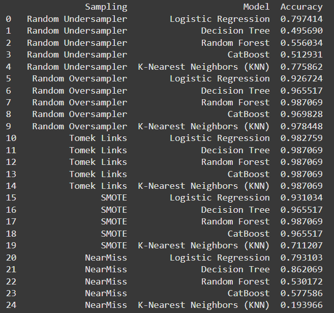

# **SAMPLING**
## **(Sampling Techniques and Model Evaluation Assignment)**

## *Project Description*

This project evaluates the performance of different sampling techniques applied to a dataset to address class imbalance issues. Five sampling techniques were applied to a set of machine learning models, and their accuracies were compared to determine which combination of sampling technique and model yields the best performance.

## *Dataset*

The dataset used for this assignment is the [Creditcard_data.csv](./Creditcard_data.csv), which contains imbalanced class distributions. The goal is to balance the classes using various sampling techniques and evaluate the model performances on these balanced datasets.

## *Objectives*

1. *Class Balancing*:
   - Address the class imbalance using five sampling techniques:
     - Random Undersampling
     - Random Oversampling
     - Tomek Links
     - SMOTE
     - NearMiss

2. *Model Evaluation*:
   - Evaluate the performance of five machine learning models:
     - Logistic Regression
     - Decision Tree
     - Random Forest
     - CatBoost
     - K-Nearest Neighbors (KNN)

3. *Determine Optimal Sampling Technique*:
   - Identify the sampling technique that gives the highest accuracy for each model.

## *Methodology*

### Steps:
1. *Data Preprocessing*:
   - Load the dataset and separate features (X) and target (y).

2. *Sampling Techniques*:
   - Applied five techniques to balance the classes:
     - *Random Undersampler*: Removes instances from the majority class.
     - *Random Oversampler*: Duplicates instances from the minority class.
     - *Tomek Links*: Removes overlapping samples to make classes more separable.
     - *SMOTE*: Generates synthetic samples for the minority class.
     - *NearMiss*: Selects samples based on their proximity to other classes.

3. *Model Training*:
   - Used the following models for evaluation:
     - Logistic Regression
     - Decision Tree
     - Random Forest
     - CatBoost
     - K-Nearest Neighbors (KNN)
   - Each model was trained and tested using the balanced datasets created from the sampling techniques.

4. *Performance Evaluation*:
   - The accuracy of each model was calculated and compared across all sampling techniques.

## Results

The table below summarizes the accuracies achieved by each model for each sampling technique. 

### *Key Observations:*
- *Random Oversampler* and *Tomek Links* produced the best results across most models.
- *Random Forest* and *Tomek Links* achieved the highest accuracy of *0.987069*.
- *KNN* showed poor performance with *NearMiss* sampling, highlighting its sensitivity to undersampling.

### Best Sampling Technique for Each Model:
| Model                      | Best Sampling Technique  | Accuracy  |
|----------------------------|--------------------------|-----------|
| Logistic Regression        | Tomek Links             | 0.982759  |
| Decision Tree              | Tomek Links             | 0.987069  |
| Random Forest              | Tomek Links             | 0.987069  |
| CatBoost                   | Random Oversampler      | 0.969828  |
| K-Nearest Neighbors (KNN)  | Random Oversampler      | 0.978448  |

## *Conclusion*

This project highlights the critical role of sampling techniques in enhancing model performance, especially when dealing with imbalanced datasets. The findings reveal that combining Tomek Links with models like Random Forest or Decision Tree consistently yields superior results. Ultimately, the choice of sampling technique should align with the specific requirements and constraints of the model to optimize its effectiveness.